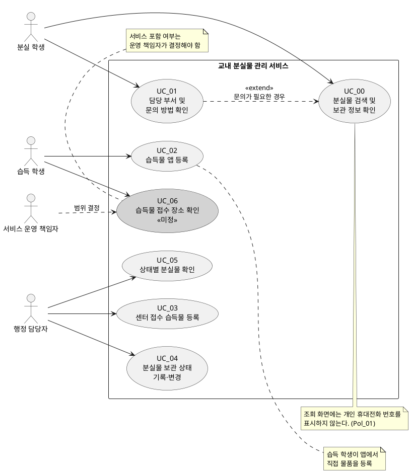

# Use Case v0.1 — 교내 분실물 관리 서비스

## 1. 작성 기준

Use Case는 하나의 서비스 단위로 식별했다. 이번 확정 사항에 따라 습득 학생의 앱 등록과 행정 담당자의 분실물 센터 접수 물품 등록은 목적·시작 조건이 다르므로 별도 Use Case로 분리했다. 사진 자동 매칭·자동 알림은 제외하며, 습득물 접수 장소 안내는 범위가 미정이다.

## 2. 액터 목록

| 액터 | 역할과 시스템 이용 목적 | 다이어그램 표시 |
|---|---|---|
| 분실 학생 | 행정실 방문 전에 물품의 보관 여부·위치와 문의 방법을 확인한다. | 주 액터 |
| 습득 학생 | 습득한 물품을 앱에서 바로 등록한다. 접수 장소 안내 기능은 범위가 미정이다. | 주 액터 |
| 행정 담당자 | 분실물 센터로 접수된 습득 물품을 등록하고, 보관·인도 상태를 관리한다. | 주 액터 |
| 서비스 운영 책임자 | 습득물 접수 장소 안내의 서비스 포함 여부와 운영 정책을 결정한다. | 의사결정 이해관계자 |
| 정보보호 담당자 | 조회 화면에서 공개할 정보의 범위를 검토한다. 직접 수행 기능은 정의되지 않았다. | 이해관계자 |

## 3. Use Case 목록

| ID | Use Case | 액터 | 사용자 목표(무엇을 왜 하는가) | 상태 | 관련 요구사항 |
|---|---|---|---|---|---|
| UC_00 | 분실물 검색 및 보관 정보 확인 | 분실 학생 | 방문 전에 물품의 보관 여부와 위치를 확인하여 불필요한 행정실 방문을 줄인다. | 포함 | NEEDS_1, FR_01, FR_02 |
| UC_01 | 담당 부서 및 문의 방법 확인 | 분실 학생 | 검색 결과만으로 해결되지 않을 때 개인 연락처 없이 담당 부서에 문의할 방법을 확인한다. | 포함 | NEEDS_4, FR_06 |
| UC_02 | 습득물 앱 등록 | 습득 학생 | 습득한 물품 정보를 앱에 바로 등록하여 분실 학생이 물품을 조회할 수 있게 한다. | 포함 | NEEDS_2, FR_03 |
| UC_03 | 센터 접수 습득물 등록 | 행정 담당자 | 분실물 센터로 접수된 습득 물품을 등록하여 조회·관리가 가능하게 한다. | 포함 | NEEDS_2, FR_04 |
| UC_04 | 분실물 보관 상태 기록·변경 | 행정 담당자 | 물품이 보관 중인지 인도 완료인지 기록하여 현재 처리 상태를 관리한다. | 포함 | NEEDS_3, FR_05, Pol_06 |
| UC_05 | 상태별 분실물 확인 | 행정 담당자 | 보관 중 물품과 인도 완료 물품을 구분하여 관리 대상을 확인한다. | 포함 | NEEDS_3, FR_05, Pol_06 |
| UC_06 | 습득물 접수 장소 확인 | 습득 학생 | 주운 물건을 어디에 맡길지 확인한다. | 미정 | NEEDS_5, SC4 |

## 4. Use Case Diagram

## 5. Use Case Description

### UC_00 — 분실물 검색 및 보관 정보 확인

| 항목 | 내용 |
|---|---|
| ID / 이름 | UC_00 / 분실물 검색 및 보관 정보 확인 |
| 사용자와 목표 | **분실 학생**이 물품을 검색하여 보관 여부와 위치를 확인하고, 불필요한 행정실 방문을 줄인다. |
| 관련 고객 요구·정책 ID | NEEDS_1, NEEDS_6 / Pol_01 관련 SRS: FR_01, FR_02, NFR_01, NFR_03 |
| 사전조건 / 시작 사건 | 사전조건: 조회 대상 물품 정보가 등록되어 있다. 시작 사건: 분실 학생이 분실물을 찾기 위해 조회 기능을 선택한다. |
| 기본 흐름 | 1. 학생이 검색 조건을 입력한다. 2. 시스템이 등록 물품을 조회한다. 3. 시스템이 일치하는 물품의 보관 여부와 위치를 표시한다. 4. 학생이 결과를 확인한다. |
| 대안·예외 흐름 | A1. **분기: 조회 결과 생성** → 조건: 일치 물품이 없음 → 대응: 시스템이 결과 없음을 안내 → 종료(물품 정보는 변경하지 않음). A2. **분기: 결과 확인** → 조건: 추가 문의가 필요함 → 대응: 학생이 UC_01을 시작 → UC_01 완료 후 종료. |
| 사후조건 | 성공: 학생이 보관 여부·위치를 확인하며 물품 데이터는 변경되지 않는다. 실패·취소: 등록 물품 데이터는 변경되지 않는다. [논의] 입력한 검색 조건을 화면에 유지할지 결정이 필요하다. |
| 미확정 사항·고객 질문 | [논의] 검색 조건(물품명·습득 장소·습득일 등)은 무엇인가? [논의] 보관 여부·위치 외에 공개할 항목과 위치의 상세 수준은 무엇인가? |

### UC_01 — 담당 부서 및 문의 방법 확인

| 항목 | 내용 |
|---|---|
| ID / 이름 | UC_01 / 담당 부서 및 문의 방법 확인 |
| 사용자와 목표 | **분실 학생**이 담당 부서와 문의 방법을 확인하여, 개인 연락처 없이 추가 확인을 요청할 수 있다. |
| 관련 고객 요구·정책 ID | NEEDS_4, NEEDS_6 / Pol_01 관련 SRS: FR_06, NFR_01, NFR_03 |
| 사전조건 / 시작 사건 | 사전조건: 담당 부서와 문의 방법이 등록되어 있다. 시작 사건: UC_00 결과만으로 확인하기 어렵거나 학생이 문의 방법을 선택한다. |
| 기본 흐름 | 1. 학생이 문의 방법 확인을 선택한다. 2. 시스템이 담당 부서와 문의 방법을 표시한다. 3. 학생이 표시된 방법으로 문의 준비를 한다. |
| 대안·예외 흐름 | A1. **분기: 문의 정보 조회** → 조건: 안내 정보가 등록되지 않음 → 대응: 시스템이 문의 안내를 제공할 수 없음을 표시 → 종료(물품 데이터는 변경하지 않음). A2. **분기: 안내 표시** → 조건: 개인 휴대전화 번호가 포함됨 → 대응: 시스템이 해당 번호를 표시하지 않음 → 안내 가능한 부서 정보만 표시 후 기본 흐름 3으로 복귀. |
| 사후조건 | 성공: 학생이 문의할 담당 부서와 방법을 확인한다. 실패·취소: 물품·개인정보 데이터는 변경하지 않으며, 개인 휴대전화 번호는 표시하지 않는다. |
| 미확정 사항·고객 질문 | [논의] 담당 부서명, 대표 전화번호, 운영 시간, 방문 안내 중 무엇을 표시할 것인가? 안내 정보가 없을 때 대체 안내 문구는 무엇인가? |

### UC_02 — 습득물 앱 등록

| 항목 | 내용 |
|---|---|
| ID / 이름 | UC_02 / 습득물 앱 등록 |
| 사용자와 목표 | **습득 학생**이 습득한 물품을 앱에서 바로 등록하여, 분실 학생이 물품을 조회할 수 있게 한다. |
| 관련 고객 요구·정책 ID | NEEDS_2, NEEDS_6 / Pol_02, Pol_03, Pol_07 관련 SRS: FR_03, NFR_01, NFR_04 |
| 사전조건 / 시작 사건 | 사전조건: 습득 학생이 앱의 등록 기능에 접근할 수 있다. 학교 인증 연동은 사용하지 않는다. 시작 사건: 습득 학생이 물품을 습득하고 등록을 선택한다. |
| 기본 흐름 | 1. 학생이 앱에서 습득물 등록을 선택한다. 2. 학생이 물품 정보를 입력한다. 3. 시스템이 필수 항목을 확인한다. 4. 시스템이 물품 정보를 저장한다. 5. 시스템이 등록 완료를 알린다. |
| 대안·예외 흐름 | A1. **분기: 필수 항목 확인** → 조건: 필수 항목 누락 또는 형식 오류 → 대응: 시스템이 항목을 안내 → 기본 흐름 2로 복귀. A2. **분기: 저장** → 조건: 저장에 실패함 → 대응: 시스템이 실패를 알리고 재시도를 안내 → [논의] 입력값 임시 보존 여부 결정 후 기본 흐름 2로 복귀 또는 취소 종료. A3. **분기: 사용자 취소** → 조건: 학생이 등록을 취소함 → 대응: 저장하지 않음 → 종료. |
| 사후조건 | 성공: 조회 가능한 습득 물품 정보가 생성된다. 실패·취소: 완전한 물품 기록은 생성하지 않는다. [논의] 취소·저장 실패 시 입력값을 임시 저장할지 결정이 필요하다. |
| 미확정 사항·고객 질문 | [논의] 필수 입력 항목은 무엇인가? [논의] 앱 등록 물품을 행정 담당자가 검토·수정해야 하는가? [논의] 중복 물품 등록을 어떻게 처리하는가? |

### UC_03 — 센터 접수 습득물 등록

| 항목 | 내용 |
|---|---|
| ID / 이름 | UC_03 / 센터 접수 습득물 등록 |
| 사용자와 목표 | **행정 담당자**가 분실물 센터로 접수된 습득 물품을 등록하여, 물품을 조회·관리할 수 있게 한다. |
| 관련 고객 요구·정책 ID | NEEDS_2, NEEDS_7, NEEDS_6 / Pol_02, Pol_03, Pol_07 관련 SRS: FR_04, NFR_02, NFR_04 |
| 사전조건 / 시작 사건 | 사전조건: 행정 담당자가 등록 기능을 사용할 수 있다. 시작 사건: 분실물 센터가 습득 물품을 접수한다. |
| 기본 흐름 | 1. 담당자가 센터 접수 습득물 등록을 선택한다. 2. 담당자가 물품 정보를 입력한다. 3. 시스템이 필수 항목을 확인한다. 4. 시스템이 물품 정보를 저장한다. 5. 시스템이 등록 완료를 알린다. |
| 대안·예외 흐름 | A1. **분기: 필수 항목 확인** → 조건: 필수 항목 누락 또는 형식 오류 → 대응: 시스템이 항목을 안내 → 기본 흐름 2로 복귀. A2. **분기: 저장** → 조건: 저장에 실패함 → 대응: 시스템이 실패를 알리고 재시도를 안내 → [논의] 입력값 임시 보존 여부 결정 후 기본 흐름 2로 복귀 또는 취소 종료. A3. **분기: 등록 취소** → 조건: 담당자가 취소함 → 대응: 저장하지 않음 → 종료. |
| 사후조건 | 성공: 조회 가능한 센터 접수 습득 물품 정보가 생성된다. 실패·취소: 완전한 물품 기록은 생성하지 않는다. [논의] 취소·저장 실패 시 입력값을 임시 저장할지 결정이 필요하다. |
| 미확정 사항·고객 질문 | [논의] 행정 담당자의 등록 권한은 어떻게 부여하는가? [논의] 학생 앱 등록 물품과 센터 접수 물품의 중복 여부를 어떻게 확인하는가? [논의] 등록 부담 측정 기준과 목표는 무엇인가? |

### UC_04 — 분실물 보관 상태 기록·변경

| 항목 | 내용 |
|---|---|
| ID / 이름 | UC_04 / 분실물 보관 상태 기록·변경 |
| 사용자와 목표 | **행정 담당자**가 물품 상태를 보관 중 또는 인도 완료로 기록·변경하여, 현재 처리 상태를 정확히 관리한다. |
| 관련 고객 요구·정책 ID | NEEDS_3 / Pol_06 관련 SRS: FR_05 |
| 사전조건 / 시작 사건 | 사전조건: 대상 분실물 정보가 등록되어 있다. 시작 사건: 물품을 등록했거나 보관 중인 물품을 학생에게 인도한다. |
| 기본 흐름 | 1. 담당자가 대상 물품을 선택한다. 2. 담당자가 상태를 보관 중 또는 인도 완료로 선택한다. 3. 시스템이 상태 변경 가능 여부를 확인한다. 4. 시스템이 선택한 상태를 저장한다. 5. 시스템이 변경된 상태를 표시한다. |
| 대안·예외 흐름 | A1. **분기: 대상 선택** → 조건: 대상 물품을 찾을 수 없음 → 대응: 시스템이 물품 확인을 요청 → 기본 흐름 1로 복귀 또는 종료. A2. **분기: 상태 변경 확인** → 조건: 변경 권한이 없거나 인도 완료 조건을 만족하지 않음 → 대응: 시스템이 변경하지 않고 사유를 안내 → 종료. A3. **분기: 저장** → 조건: 저장에 실패함 → 대응: 시스템이 실패를 알림 → 기존 상태를 보존하고 기본 흐름 1로 복귀 또는 종료. |
| 사후조건 | 성공: 대상 물품의 상태가 보관 중 또는 인도 완료로 기록된다. 실패·취소: 기존 상태를 보존하고 상태 변경 이력은 생성하지 않는다. |
| 미확정 사항·고객 질문 | [논의] 누가 상태를 변경할 수 있는가? [논의] 인도 완료 처리 전에 어떤 인도 확인이 필요한가? [논의] 잘못 변경한 상태의 정정 절차와 이력 보존 기준은 무엇인가? |

### UC_05 — 상태별 분실물 확인

| 항목 | 내용 |
|---|---|
| ID / 이름 | UC_05 / 상태별 분실물 확인 |
| 사용자와 목표 | **행정 담당자**가 보관 중과 인도 완료 물품을 구분하여 확인하고, 현재 관리해야 할 물품을 빠르게 파악한다. |
| 관련 고객 요구·정책 ID | NEEDS_3 / Pol_06 관련 SRS: FR_05 |
| 사전조건 / 시작 사건 | 사전조건: 분실물 정보와 상태가 등록되어 있다. 시작 사건: 담당자가 상태별 물품 현황 확인을 선택한다. |
| 기본 흐름 | 1. 담당자가 상태별 분실물 확인을 선택한다. 2. 시스템이 보관 중 물품과 인도 완료 물품을 구분하여 표시한다. 3. 담당자가 관리할 물품을 확인한다. |
| 대안·예외 흐름 | A1. **분기: 상태별 목록 조회** → 조건: 선택한 상태의 물품이 없음 → 대응: 시스템이 결과 없음을 표시 → 종료. A2. **분기: 상태 데이터 확인** → 조건: 등록 물품에 상태가 없음 → 대응: 시스템이 상태 미기록 항목을 별도로 안내 → [논의] 담당자가 UC_04로 이동해 상태를 입력할지 결정 후 종료 또는 UC_04로 복귀. |
| 사후조건 | 성공: 담당자가 상태별 관리 대상을 확인하며 물품 데이터는 변경되지 않는다. 실패·취소: 물품 상태와 목록 데이터는 변경하지 않는다. |
| 미확정 사항·고객 질문 | [논의] 상태 미기록 물품을 허용하는가? [논의] 상태별 목록에 필요한 정렬·검색 조건은 무엇인가? |

### UC_06 — 습득물 접수 장소 확인 (미정)

| 항목 | 내용 |
|---|---|
| ID / 이름 | UC_06 / 습득물 접수 장소 확인 |
| 사용자와 목표 | **습득 학생**이 습득물을 맡길 장소를 확인하여 적절한 접수처에 물품을 전달한다. |
| 관련 고객 요구·정책 ID | NEEDS_5 / 해당 정책 없음 관련 SRS: 현재 해당 없음 |
| 사전조건 / 시작 사건 | 사전조건: 서비스 포함 여부가 결정되어야 한다. 시작 사건: 습득 학생이 접수 장소 안내를 선택한다. |
| 기본 흐름 | [논의] 서비스 포함 여부와 제공할 장소 정보가 결정되지 않아 기본 흐름을 확정하지 않는다. |
| 대안·예외 흐름 | A1. **분기: 서비스 범위 결정** → 조건: 기능이 이번 개발 범위에서 제외됨 → 대응: 시스템 기능을 제공하지 않음 → 종료. A2. **분기: 장소 정보 조회** → 조건: 안내 정보가 없거나 최신 정보가 아님 → 대응: [논의] 대체 안내 방법과 정보 갱신 책임자를 결정해야 함 → 종료 또는 기본 흐름으로 복귀. |
| 사후조건 | 성공: 서비스가 포함되는 경우 학생이 접수 장소를 확인한다. 실패·취소: 물품 데이터는 생성·변경하지 않는다. |
| 미확정 사항·고객 질문 | [논의] 이 기능을 이번 서비스에 포함하는가? [논의] 기존 안내 수단은 무엇인가? [논의] 장소 정보의 관리·갱신 책임자는 누구인가? |

## 6. 고객 확인 질문

| ID | 확인 질문 | 영향 받는 Use Case |
|---|---|---|
| Q_01 | 분실 학생은 어떤 검색 조건(예: 물품명, 습득 장소, 습득일)으로 분실물을 찾아야 하나요? | UC_00 |
| Q_02 | 조회 결과에 보관 여부와 위치 외에 어떤 물품 정보를 공개해야 하나요? | UC_00 |
| Q_03 | 문의 방법에는 담당 부서명, 전화번호, 운영 시간, 방문 안내 중 무엇을 표시해야 하나요? | UC_01 |
| Q_04 | 습득 학생의 앱 등록과 행정 담당자의 센터 접수 등록에 각각 필요한 필수 입력 항목은 무엇인가요? | UC_02, UC_03 |
| Q_05 | 행정 담당자는 습득 학생이 앱에서 등록한 물품도 검토하거나 수정해야 하나요? 필요하다면 어떤 범위까지 가능한가요? | UC_02, UC_04 |
| Q_06 | 분실물 상태를 변경할 수 있는 담당자는 누구이며, 인도 완료로 바꾸기 전에 어떤 확인이 필요한가요? | UC_04 |
| Q_07 | 잘못 변경한 상태를 누가 어떤 절차로 정정할 수 있나요? | UC_04 |
| Q_08 | 습득물 접수 장소 안내를 이번 서비스에 포함하나요? 포함한다면 어떤 장소·안내 정보를 제공하나요? | UC_06 |
